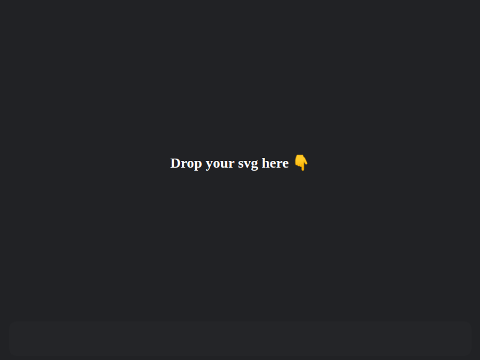

# Simple SVG Viewer

This is a very minimal SVG files viewer made with Electron.

## To Use

- npm install
- npm start
- Drag and drop an svg file inside the application

## To run tests

- npm test

## License

[CC0 1.0 (Public Domain)](LICENSE.md)
